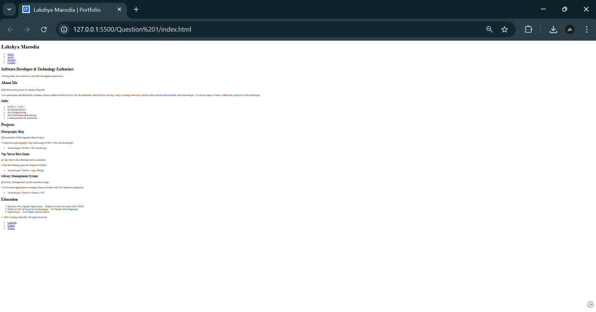
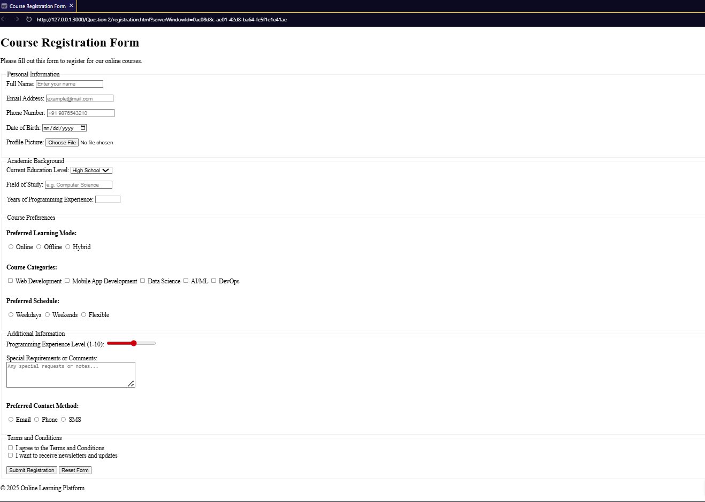
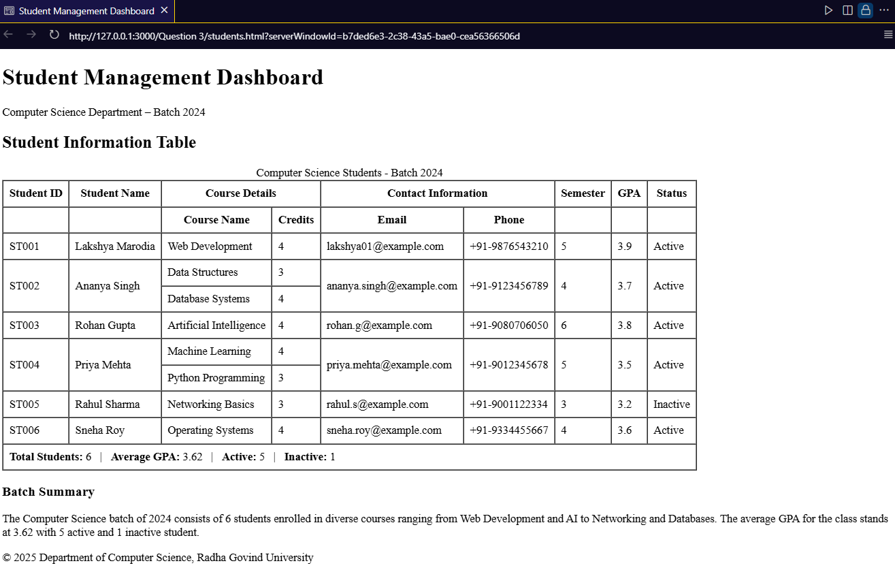

# 🌐 HTML Fundamentals - Assignment

### 📘 Overview

This repository contains solutions for the **HTML Fundamentals Assignment**, demonstrating knowledge of **HTML structure, semantic tags, forms, tables, and lists**.
Each question is organized into its respective folder for better readability and easy access.

---

## 📁 Repository Structure

```
html-fundamentals-assignment/
├── question1/
│   ├── index.html
│   └── favicon.ico
├── question2/
│   └── registration.html
├── question3/
│   └── students.html
└── screenshots/
    ├── question1-screenshot.png
    ├── question2-screenshot.png
    └── question3-screenshot.png
```

---

## 🧩 Questions Breakdown

### 🏁 **Question 1: HTML Structure & Semantic Tags**

**File:** `question1/index.html`

* Created a complete HTML5 structure with proper boilerplate.
* Used **semantic tags** like `<header>`, `<main>`, `<section>`, and `<footer>` for better readability and accessibility.
* Added a **favicon** (`favicon.ico`) for a professional and polished touch.

📸 **Screenshot:**


---

### 📝 **Question 2: Registration Form**

**File:** `question2/registration.html`

* Built an **HTML form** with input fields for name, email, password, gender, and course selection.
* Applied attributes such as `required`, `placeholder`, and used `<label>` for accessibility.
* Organized the layout with `<fieldset>` and `<legend>` for clarity.

📸 **Screenshot:**


---

### 📋 **Question 3: Student Table**

**File:** `question3/students.html`

* Designed a **responsive HTML table** displaying student information.
* Used `<thead>`, `<tbody>`, and `<tfoot>` for proper structure.
* Ensured clean indentation and readable code with semantic markup.

📸 **Screenshot:**


---

## ⚙️ Technical Details

| Feature               | Description                                           |
| --------------------- | ----------------------------------------------------- |
| **Language Used**     | HTML5                                                 |
| **Favicon Added**     | Yes                                                   |
| **Code Style**        | Semantic, Indented, and Readable                      |
| **Accessibility**     | Proper use of labels, alt text, and semantic elements |
| **File Naming**       | lowercase-with-hyphens                                |
| **Screenshot Format** | PNG                                                   |

---

## 🚀 How to View the Project

1. **Clone the repository:**

   ```bash
   git clone https://github.com/LAKSHYAMARODIA01/html-fundamentals-assignment
   ```

2. **Open any HTML file in your browser:**

   * `question1/index.html`
   * `question2/registration.html`
   * `question3/students.html`

3. **Preview the screenshots** in the `screenshots/` folder to see the output results.

---

## 🧠 Learning Objectives

By completing this assignment, I have:

* Understood how to structure **HTML documents** properly.
* Applied **semantic HTML5 elements** for clarity and SEO.
* Created **accessible and well-structured forms**.
* Designed **tables** to present data effectively.

---

## 📎 Repository Link

🔗 [https://github.com/LAKSHYAMARODIA01/html-fundamentals-assignment](https://github.com/LAKSHYAMARODIA01/html-fundamentals-assignment)

---

## ✨ Author

**👤 Lakshya Marodia**
🎓 *Bachelor of Computer Application (BCA), Radha Govind University*
💻 *Minor in CSE & Next-Gen Technologies, IIT Mandi*
🌐 [LinkedIn Profile](https://www.linkedin.com/in/lakshya-marodia)

